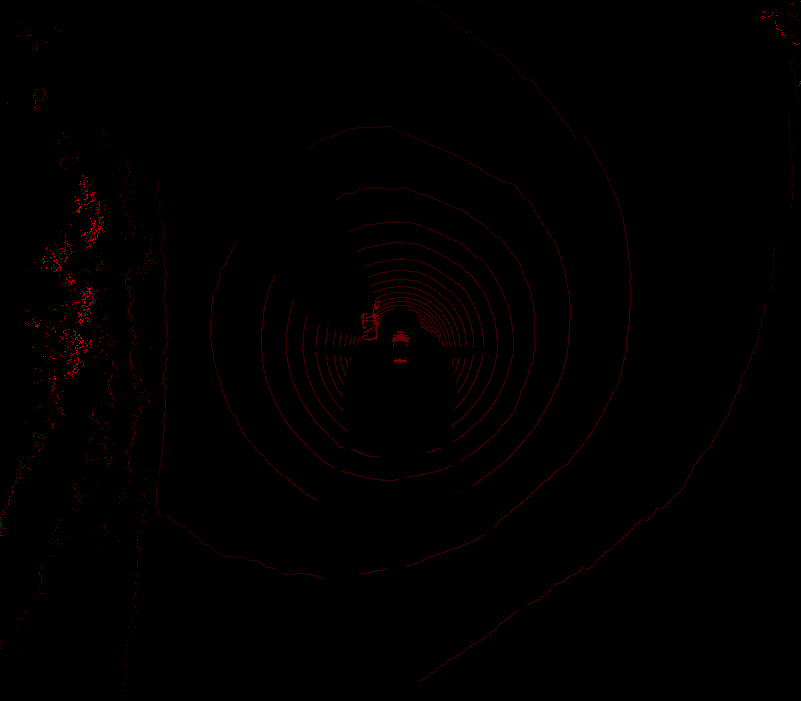

# height-map
</img>

Currently, this ROS workspace processes LIDAR data to create PNG "bird's eye" height maps for use in deep learning applications. All of the real code currently resides in ```/ros-examples/src/lidar/src/lidar_node.cpp```.

To use this node, first build. You'll need OpenCV dependencies, but that should be included in ROS. If you want to save the images, create a folder in the ROS root workspace (where this readme is located) called ```images```. Everything will automatically be saved there.

To run: ```rosrun lidar lidar_node```

You should see an image window pop up. The point cloud topic is hard coded in lidar_node.cpp. You may need to change that to ```/points_raw```. After this node is up, play your bag file.

# ros-examples
Want to learn how to use the Robot Operating System (ROS), the Point Cloud Library (PCL), and a bunch of other cool tools to make a self-driving car or other awesome robot? This repository is home to a collection of ROS nodes that process 3D sensor information, specifically as examples for the Udacity/Didi $100k object detection challenge. Learn about obstacle fusion techniques, and use these nodes as a starting point for building your own awesome obstacle detection engine!

For more info, check out the main competition site [here](https://www.udacity.com/didi-challenge).

If you have any issues, create a pull request! I'd love to add your contributions to this repo. Alternatively, shoot me a tweet at [macjshiggins](https://twitter.com/macjshiggins).

# setup
This is a standard ROS catkin-ized workspace. Don't know what that means? Check out a great intro on ROS [here](http://wiki.ros.org/ROS/Tutorials) or head on over to [Udacity](http://udacity.com) to sign up for the Robotics or Self-Driving Car Engineer Nanodegree.

There's currently only one node for processing LIDAR data. Use "catkin_make" in the root of this repo to build the lidar node, and run with ```rosrun lidar lidar_node``` after installing PCL and ROS (Indigo, preferably).

If you've downloaded any of the datasets for the challenge, you can start using the data with these nodes immediately by running ```rosbag play -l name-of-file.bag```. The "-l" keeps the bag file playing on repeat so that you can keep working on your algorithm without having to mess with the data playback.
